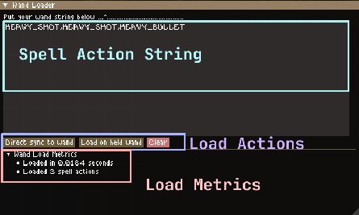

# CxRedix's Wand Box

For all your Noita wand shenanigans!

## Prerequisites
1. Download [Noita Dear Imgui](https://github.com/dextercd/Noita-Dear-ImGui) here! this is required for the UI in wand box :)


## Installation instructions
1. download the zip by clicking on the big blue "<> Code" button, and clicking on "Download ZIP" (if you are downloading from github)

2. extract this into your noita mods' directory.
check this [tutorial from the Noita wiki](https://noita.wiki.gg/wiki/How_to_install_mods#Manual) Go to the "Manual" section :)

3. go to your in game mods list (the place where you view all mods in game), make sure you move this mod UNDER Noita Dear Imgui.
This is required since Noita Dear Imgui has to load first :)


### Wand Box Menu
The wand box menu should show up at the bottom center of your screen, it should have the text "CxRedix's Wand Box" on it.

You can click on it and it should show up all the tools that are available! (There is only "Wand Loader" for now)


### Wand Loader



The wand loader consists of a few things:

1. Wand action string box (The big box in the center)
- The format for wand action string is as follows:
    ```
    The most simplest format is:
    SPELL_ID1, SPELL_ID2, SPELL_ID3, SPELL_ID1

    this should create 4 spell actions, each utilizing their in game ID name.

    for example:
    MANA_REDUCE, HEAVY_SHOT, HEAVY_SHOT, HEAVY_BULLET

    this one creates 4 spell actions, one add mana(aka MANA_REDUCE),
    two heavy shots and one magic bolt (aka HEAVY_BULLET)

    a more complicated format is:
    SPELL_ID1, SPELL_ID2, 2, 2, 3, 1;

    [SPELL_ID3]: 1, [SPELL_ID4]: 2, [SPELL_ID5]: 3
    
    we now have two sections, separated by a semicolon ";". first section are the spell ids / spell action alias groups

    the second section denotes any spell action alias groups, so here we aliased "SPELL_ID3" as 1, "SPELL_ID4" as 2,
    and "SPELL_ID5" as 3.


    for example:
    MANA_REDUCE, MANA_REDUCE, HEAVY_SHOT, HEAVY_SHOT, HEAVY_SHOT, HEAVY_SHOT, HEAVY_SHOT, HEAVY_BULLET

    the above can be shortened into:

    1, 1, 2, 2, 2, 2, 2, HEAVY_BULLET;

    [MANA_REDUCE]: 1, [HEAVY_SHOT]: 2


    Sometimes your spell actions will repeat a bunch of times, and it's very annoying to type them all out, you can
    instead create alias groups with multiple spell actions:

    for example, this can be shortened into:
    HEAVY_SHOT, HEAVY_BULLET, HEAVY_SHOT, HEAVY_BULLET, HEAVY_SHOT, HEAVY_BULLET, HEAVY_SHOT, HEAVY_BULLET

    1, 1, 1, 1;
    [HEAVY_SHOT, HEAVY_BULLET]: 1
    
    you can put 1 or more spell actions within the square brackets "[]", separated between ","

    Additional note: spaces and newlines are not necessary / mandatory, you can omit them entirely :)
    ```

**NOTE:** The format to load wands are subject to change :), BUT the first basic format should be stable :D

2. Wand load actions (Buttons that show up ONLY when you have text placed in the action string box)
- "Direct sync to wand": VERY USEFUL FOR REALLY BIG WANDS(tested with 800k+ spell actions),
        this forces the spell actions to SYNC directly to the in game "gun.lua"(which is what actually handles the wand casts),
        you can still cast spells normally, BUT the game will not spawn wand particles.

**NOTE:** When using this method, refreshing the wand will make the game load the dummy spell "add mana" as `card_action`
in the wand entity, and "FORCE" sync + load your ACTUAL actions DIRECTLY in "gun.lua".
So for example, any means of "opening the inventory", "swapping to another wand", "restarting the game" will refresh everything 
and you will lose the deck that was force loaded, and you will only get "add mana" :(

- "Load on held wand": NOT RECOMMENDED FOR BIG WANDS, this is what you would usually expect, loading all spell actions
        as child entities in the wand.

- "Clear": clears the Wand action string box's content.

3. Wand Load metrics (Should show you some information regarding the previous wand loading process)


## Have fun <3
